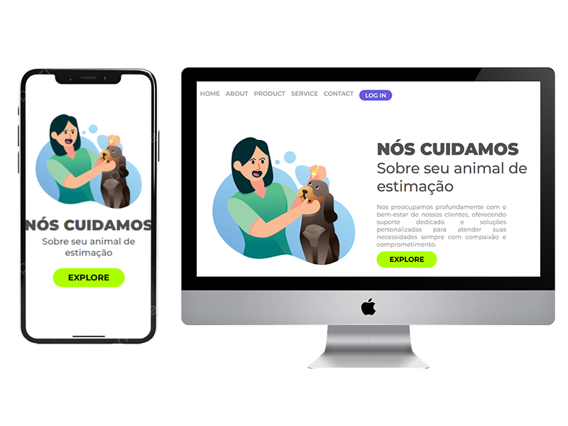

<h1> We Care </h1>
<h2>Esse é um projeto de responsividade</h2>

Esse projeto tem como objetivo garantir a responsividade, ou seja, adaptar o layout e o design de uma página ou aplicação para diferentes tamanhos de tela e dispositivos, proporcionando uma experiência de usuário otimizada em qualquer plataforma.

<h2>Tecnologias utilizadas</h2>

<h2>Imagens:</h2>

